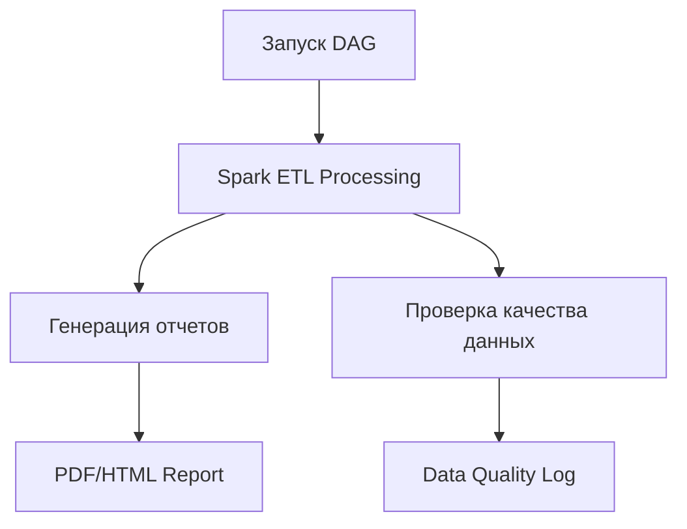

# 🚀 Financial Data ETL Pipeline with Airflow & PySpark


Профессиональный ETL-пайплайн для обработки финансовых данных с расширенной аналитикой и мониторингом качества данных.

## 📌 Основные возможности

- **ETL-обработка** данных с помощью PySpark
- **Расчет технических индикаторов** (RSI, Moving Averages, Volatility)
- **Выявление аномалий** с использованием Z-Score
- **Автоматическая генерация отчетов** (PDF/HTML) с визуализациями
- **Проверка качества данных** с детализированным логом

## 🛠 Технологический стек

| Компонент       | Назначение                          |
|-----------------|-------------------------------------|
| `Apache Airflow`| Оркестрация пайплайна               |
| `PySpark`       | Распределенная обработка данных     |
| `Pandas`        | Анализ и визуализация               |
| `Seaborn/Matplotlib`| Генерация графиков             |
| `Jinja2`        | Шаблонизация отчетов                |
| `PDFKit`        | Генерация PDF-отчетов               |

## 📊 Ключевые метрики

1. **Correlation Matrix**
2. **Price Trend with Moving Average**
4. **Seasonal Decomposition**

## ⚙️ Установка и запуск

```bash
# Клонировать репозиторий
git clone https://github.com/whiteprincewithobsession/financial-etl.git

# Установить зависимости
pip install -r requirements.txt

# Запустить Airflow
airflow standalone
```
ВАЖНО: Предпочтительнее запуск docker-образа airflow. Все нужные docker-файлы присутствуют в репозитории

## 🏗 Архитектура пайплайна


## 🔍 Основные функции обработки
```python
# Пример ключевой логики
df = df.withColumn("Daily_Volatility", col("Daily_High") - col("Daily_Low")) \
       .withColumn("Daily_Return_Pct", 
          (col("Close_Price") - col("Open_Price")) / col("Open_Price") * 100)

# Выявление аномалий
df = df.withColumn("Z_Score", 
      (col("Close_Price") - col("Rolling_Mean")) / col("Rolling_Std")) \
       .withColumn("Is_Anomaly", when(abs(col("Z_Score")) > 3, 1).otherwise(0))
```
